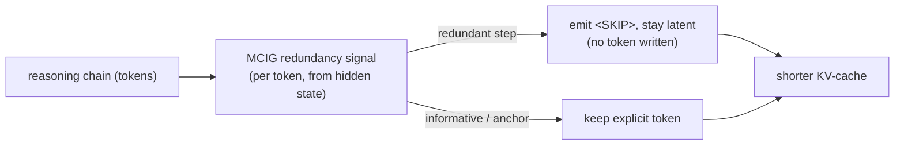
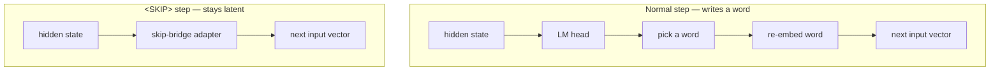
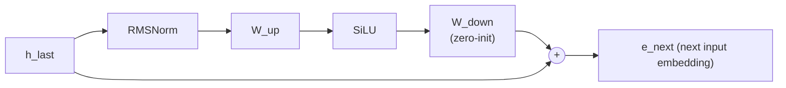
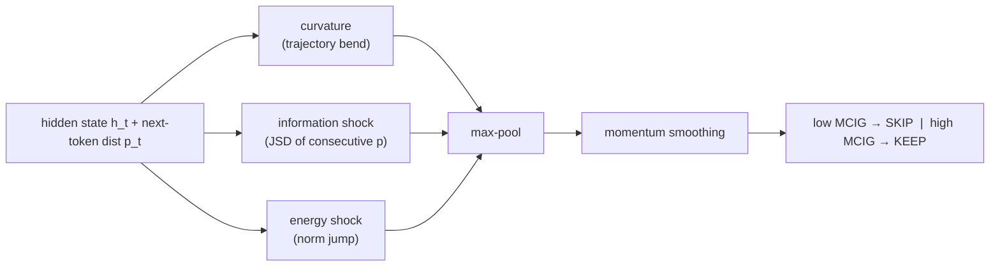
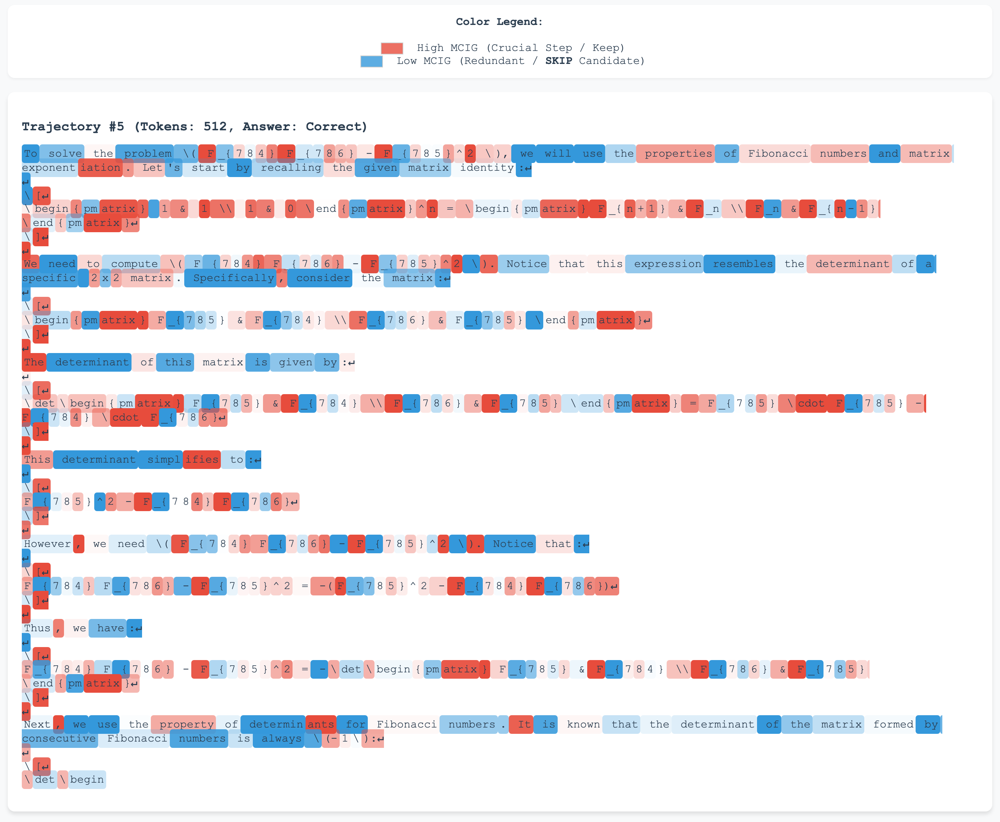
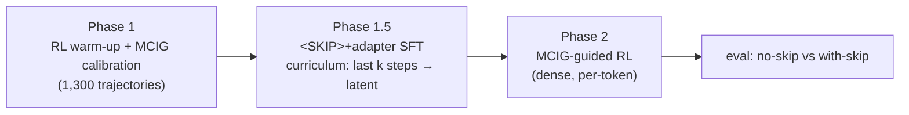
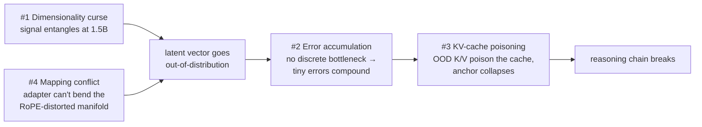

# Latent Reasoning × KV-Cache: Shrinking the Cache by Reasoning in Latent Space

*An experience report on latent "skipping" with Qwen2.5-1.5B-Instruct — the implementation, what broke,
and the lessons. Figures are the load-bearing part; prose is kept short. Citations: [`REFERENCES.md`](REFERENCES.md).*

---

## 1. Idea

Reasoning models think out loud in long chains, and many steps are filler (restating, re-deriving). Every token still adds a (Key, Value) entry to the **KV-cache** in every layer, so a 1,000-token chain costs 1,000 cache entries per layer. The idea: **detect the redundant steps and don't write them out** — emit a `<SKIP>` token and keep reasoning in latent space (work with the hidden vector directly instead of decoding a word). Shorter generated sequence → shorter KV-cache, ideally at no accuracy cost. This is the "reduce at the source" alternative to post-hoc cache compression, and a redundancy-driven version of latent/explicit switching [Shi et al., 2026; Zhang et al., 2025; Hao et al., 2024; Shen et al., 2025].

The honest result: the redundancy signal is discriminative offline, but the latent compression **breaks at 1.5B** — and the value here is a precise account of *why* (§5), which says at what scale and in what form the idea could work.

## 2. Background (one paragraph)

Explicit chain-of-thought is not just a log; discrete tokens give the model serial working memory and provably enlarge what a fixed-depth Transformer can compute [Li et al., 2024; Wei et al., 2022]. Prior latent methods either compress forward passes (Coconut [Hao et al., 2024], CODI [Shen et al., 2025] — still below explicit CoT on GSM8K) or relax decoding continuously (Soft Thinking [Zhang et al., 2025], no compute saving; SwiReasoning [Shi et al., 2026], latent/explicit switching). We pursue *selective* skipping driven by a measured redundancy signal.

## 3. The model change (what `<SKIP>` actually changes)

Only the step-to-step loop changes; the transformer stack and cache mechanics are untouched. A normal step decodes a word and re-embeds it; a `<SKIP>` step routes the hidden state through one small **skip-bridge adapter** and feeds the result straight back as the next input — no word is ever written.

The skip-bridge is a residual full-dim adapter (`d→d→d`, ~25.7M params), zero-initialized so it starts as the identity (cold start = no-op, training only *adds* skipping):

## 4. The signal: MCIG

To decide *which* steps are redundant we read it off the hidden-state geometry with **MCIG (Manifold Causal Information Gain)** — a training-free, per-token score (`compression/information_gain.py`). A step that barely bends the trajectory, barely shocks the next-token distribution, and barely changes the representation's energy is redundant.

Exact form: `C_t = max(0, 1−cos(Δĥ_t, Δĥ_{t−1}))`; `J_t = JSD(p_t ‖ p_{t−1})`; `E_t = 2·|log‖h_t‖ − log‖h_{t−1}‖|`; `MCIG_t = max( max(C_t,J_t,E_t),  0.8·MCIG_{t−1} )`. A token-level heatmap shows it does separate connective filler (blue) from decision tokens — operators, digits, `\boxed`, `### Step` (red):

## 5. Training

The curriculum ramps latent depth (Stage 0 full CoT → Stage k converts the last *k* steps to latent). Each latent position stores the original token id as an **anchor target**, trained with a cosine anchoring loss `β·(1−cos(e_next, target input embedding))`, `β=0.3`, plus an exit-token CE (×3.0) and truncated BPTT (detach every 4 latent steps) [Shao et al., 2024; Liu et al., 2025].

## 6. What broke — four roadblocks, one chain

The trained latent model regresses even before any forced skipping, and collapses with latent depth:

| forced latent steps `K` | 0 | 1 | 2 | 3 |
|---|---|---|---|---|
| accuracy (no anchor) | 54.5% | 14% | 5% | 3% |

(base model, no latent training: ~65%; `switching_experiments/results/`.) The failures form a single causal chain:

- **#1 Dimensionality curse.** MCIG is discriminative *offline* (AUC ≈ 0.72; combined 0.784) yet useless as an RL reward — the model learns a 0.1% skip ratio. *Discriminative offline ≠ optimizable.*
- **#2 Error accumulation.** Discrete tokens are an error-correcting bottleneck; without them, one latent step already drops 54.5% → 14%, ≈0 by 2–3 steps.
- **#3 KV-cache poisoning.** One out-of-distribution latent vector poisons the global cache; with anchoring (β=0.3) the model mode-collapses onto the anchor token (max prob ≈ 0.90) — accuracy 0% at `K=1`.
- **#4 Mapping conflict.** A linear/bottleneck adapter only does affine maps, so its output lands off the curved, RoPE-distorted [Su et al., 2021] hidden manifold; even RMSNorm + norm-match + a frozen anchor collapses at `K=1`. The conflict is mechanistic, not an adapter-tuning issue.

## 7. Lessons & why we paused this direction

#1 + #4 push the latent off-distribution → #2 compounds the error → #3 poisons the cache and breaks generation. The takeaways: (1) **discretization is a feature** — re-anchor periodically (drop a real token every *k* steps) instead of going fully latent; (2) **don't RL on an entangled manifold** — freeze/decouple the backbone first; (3) **protect the cache anchors** — keep anchoring weak and annealed; (4) **1.5B ≠ a small 7B** — latent planning is an emergent, scale-dependent ability [Hanna & Ameisen, 2026], so every threshold and curriculum must be re-calibrated, and the idea is more promising at larger scale. At the 1.5B budget the architectural and scale walls are real, so we paused pure latent skipping and redirected to a problem that does yield at this scale (the companion `grpo-underthinking` project).

## References

See [`REFERENCES.md`](REFERENCES.md).
